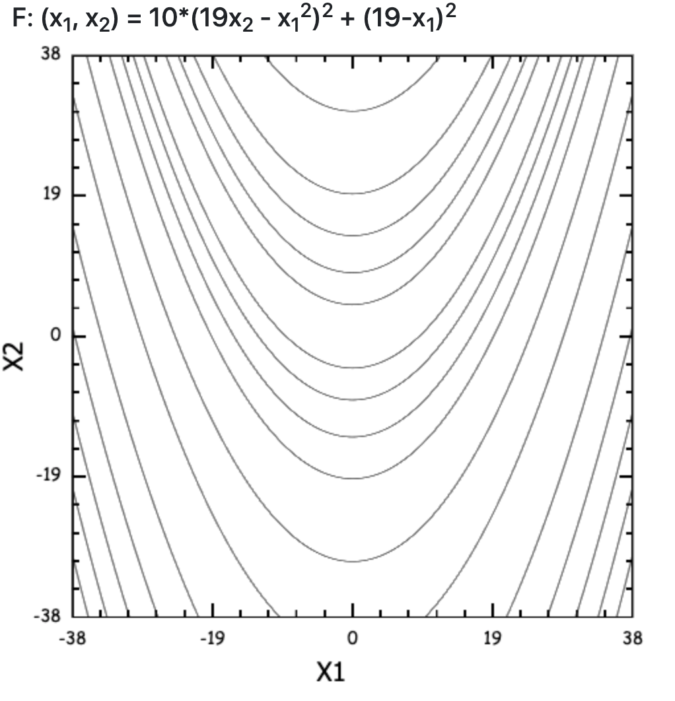
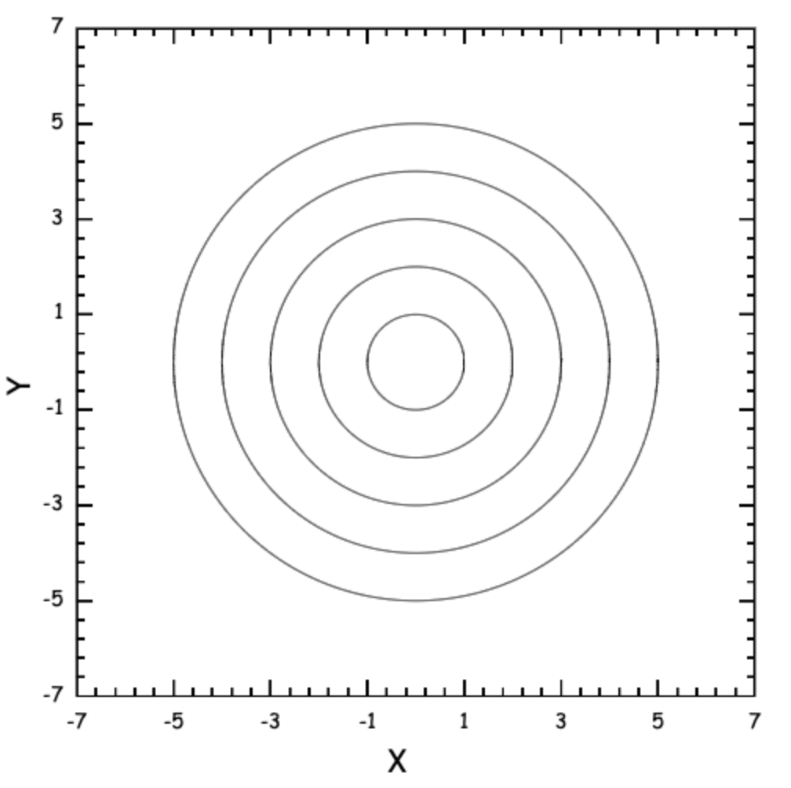

# Level line chart

## Example




## Setup

- Add file "LevelLinesChart.js" (LineLevelsChartJS/scripts/plugins/LevelLinesChart.js) to your project
- Add link to LevelLinesChart.js in your html file.

## Usage

```HTML
<html>
  ....
  <body>
    <canvas id="chart" width="500px" height="500px"></canvas>
    
    <script src="scripts/plugins/LevelLinesChart.js"></script>
	  <script>
      let chartCanvas = document.getElementById("chart");
      let ctx = chartCanvas.getContext('2d');

      const chart = new Chart228(ctx, {
        limits: {
            x: [-7, 7],
            y: [-7, 7]
        },
        data: [[{x: 0, y: 0}, {x: 1, y: 2}, {x: 1, y: -2}, {x: 0, y: 0}], [{x: 1, y: 1}, {x: 2, y: 2}]]
      });
    </script>
  </body>
</html>
```
